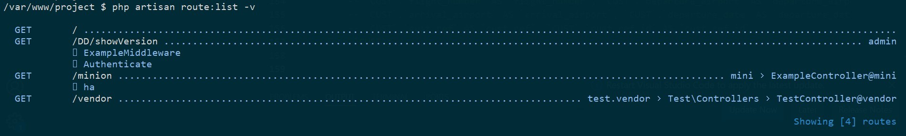

# Lumen Route List

> This package can list all routes just as Laravel do.



# Installation

Install by composer

```bash
    $ composer require chhw/route-list
```

In `bootstrap/app.php`, you should:
1. add `$app->register(CHHW\RouteList\RouteListServiceProvider::class);`

# Usage

> Just like the way to use Laravel !

```bash
php artisan route:list
```
```
options:
      --json                       Output the route list as JSON
      --method[=METHOD]            Filter the routes by method
      --name[=NAME]                Filter the routes by name
      --path[=PATH]                Only show routes matching the given path pattern
      --except-path[=EXCEPT-PATH]  Do not display the routes matching the given path pattern
  -r, --reverse                    Reverse the ordering of the routes
      --sort[=SORT]                The column (method, uri, name, action, middleware) to sort by [default: "uri"]
      --except-vendor              Do not display routes defined by vendor packages
      --only-vendor                Only display routes defined by vendor packages
  -h, --help                       Display help for the given command. When no command is given display help for the list command
  -q, --quiet                      Do not output any message
  -V, --version                    Display this application version
      --ansi|--no-ansi             Force (or disable --no-ansi) ANSI output
  -n, --no-interaction             Do not ask any interactive question
      --env[=ENV]                  The environment the command should run under
  -v|vv|vvv, --verbose             Increase the verbosity of messages: 1 for normal output, 2 for more verbose output and 3 for debug
```

# Route Example

```php
<?php

$router->get('/', function () use ($router) {
    return $router->app->version();
});

$router->get('minion', ["as" => "mini", 'uses' => 'ExampleController@mini']);

$router->group(['middleware' => ['ExampleMiddleware', 'Authenticate'], 'namespace' => 'YY', 'prefix' => 'DD', "as" => "admin"], function () use ($router) {
    $router->get('showVersion', function () use ($router) {
        return $router->app->version();
    });

});

$router->group(["as" => "test"], function () use ($router) {
    $router->get('vendor', ["as" => "vendor", "uses" => "\Test\Controllers\TestController@vendor"]);
});
```
